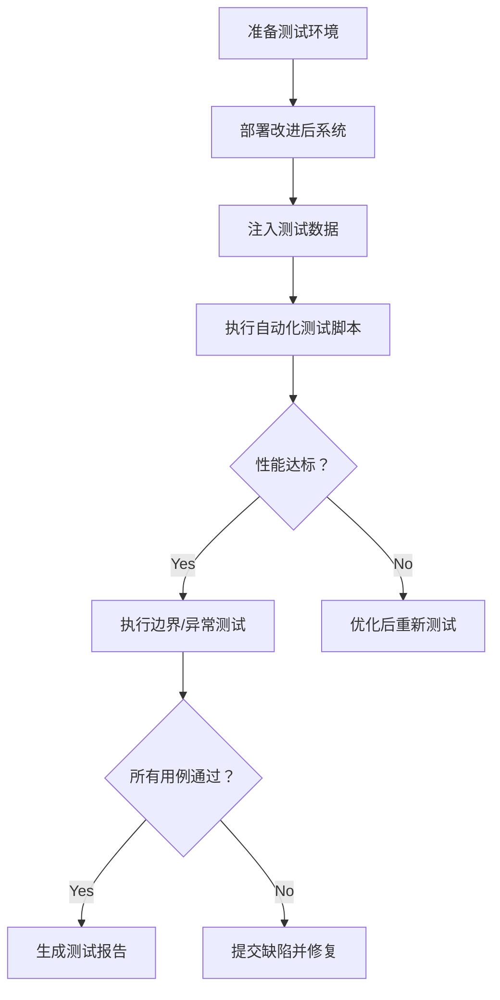

# Pro/deepseek-ai/DeepSeek-R1

## 元数据

- **耗时**: 749851ms
- **Tokens**: 2549
- **尝试次数**: 1

---

## 响应

为了全面测试改进后的多模型搜索系统，需覆盖功能、性能、健壮性及边界场景。以下是关键测试用例设计及验证方法：

---

### **一、功能测试**
1. **基础多模型搜索**  
   - **场景**：搜索词"量子计算"，调用模型A（科技论文库）、模型B（专利数据库）、模型C（新闻库）。  
   - **预期**：  
     - 返回结果包含三类来源，按统一相关性得分排序。  
     - 各模型结果占比符合权重配置（如A:B:C=4:3:3）。  
   - **验证**：检查结果来源分布及排序逻辑日志。

2. **结果去重**  
   - **场景**：模型A与模型B均返回专利《量子芯片设计》（ID: P123）。  
   - **预期**：结果中仅出现一次该专利，标注"来源：A+B"。  
   - **验证**：检查去重ID表及结果展示。

3. **动态权重调整**  
   - **场景**：用户手动提升"新闻"权重至50%，搜索"人工智能"。  
   - **预期**：新闻类结果占比显著增加，模型C结果排名提升。  
   - **验证**：对比权重调整前后的结果分布。

---

### **二、性能测试**
4. **高并发搜索**  
   - **场景**：100并发用户同时搜索"5G技术"。  
   - **预期**：  
     - 平均响应时间 ≤1.5秒（P99≤3秒）。  
     - 错误率<0.1%。  
   - **工具**：JMeter模拟负载，监控系统资源（CPU/内存）。

5. **慢模型超时处理**  
   - **场景**：模型D响应延迟（设定超时阈值2秒）。  
   - **预期**：  
     - 2秒后放弃模型D，返回其他模型结果。  
     - 日志记录"Model D timeout"。  
   - **验证**：注入延迟（如TC NetEm），观察fallback机制。

---

### **三、健壮性测试**
6. **部分模型故障**  
   - **场景**：模型B宕机，搜索"CRISPR"。  
   - **预期**：  
     - 返回模型A/C的结果，状态码200。  
     - 日志告警"Model B unavailable"。  
   - **验证**：停用模型B服务，检查系统容错。

7. **异常输入处理**  
   - **场景**：搜索词含SQL注入`' OR 1=1--`。  
   - **预期**：  
     - 返回HTTP 400，拒绝执行。  
     - 无数据库报错日志。  
   - **验证**：检查输入过滤层拦截记录。

---

### **四、边界测试**
8. **空结果集合并**  
   - **场景**：搜索"外星生命"，所有模型返回空。  
   - **预期**：友好提示"未找到相关结果"，HTTP 200。  
   - **验证**：检查空结果处理逻辑。

9. **大体积结果分页**  
   - **场景**：搜索"区块链"，返回10,000条结果，请求第50页（每页100条）。  
   - **预期**：  
     - 返回第4901-5000条结果，无丢失或重复。  
     - 响应时间≤800ms。  
   - **验证**：检查分页偏移量计算及数据库查询性能。

---

### **五、质量测试**
10. **跨语言支持**  
    - **场景**：搜索中文词"深度学习"，模型E（英文论文库）需翻译为"deep learning"。  
    - **预期**：模型E返回英文结果，并与中文结果混合排序。  
    - **验证**：检查翻译API调用日志及结果相关性。

11. **缓存命中率**  
    - **场景**：连续3次搜索"碳中和"。  
    - **预期**：  
      - 首次请求调用所有模型。  
      - 后续请求命中缓存，响应时间下降50%。  
    - **验证**：监控Redis缓存命中率及响应时间对比。

---

### **六、安全与权限**
12. **权限过滤**  
    - **场景**：普通用户搜索"新冠疫苗"，无权限访问模型F（内部研发文档）。  
    - **预期**：结果中不包含模型F数据，无权限错误提示。  
    - **验证**：模拟不同角色用户，检查权限策略执行。

---

### **测试执行流程**

### **关键指标验收标准**
- **准确性**：结果去重率≥98%，排序算法符合预期。  
- **性能**：95%请求响应时间≤1秒，单节点QPS≥200。  
- **稳定性**：48小时压测无内存泄漏，错误率<0.5%。  
- **覆盖率**：API分支覆盖≥95%，异常场景覆盖100%。

---

通过以上测试，可系统性验证多模型搜索改进的效果，确保稳定性、性能及用户体验提升符合预期。