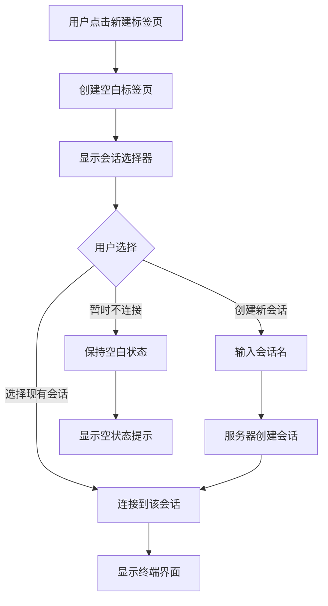

# PRD: tmux-web-term 标签页与会话架构重构

**ID**: prd-20260324-004200-a7b3
**状态**: 🟢 已确认
**版本**: v1.1
**最后更新**: 2026-03-24

---

## 1. 文档信息

### 1.1 版本历史
| 版本 | 日期 | 作者 | 变更内容 |
|------|------|------|---------|
| v1.1 | 2026-03-24 | AI | 多模型分析更新 - 添加痛点分析、竞品对比、架构建议 |
| v1.0 | 2026-03-24 | AI | 初始版本 - 标签页与会话概念分离

### 1.2 相关人员
| 角色 | 人员 | 职责 |
|------|------|------|
| 产品负责人 | throokie | 需求确认、架构决策 |
| 技术负责人 | AI | 技术方案设计、代码实现 |

---

## 2. 产品概述

### 2.1 背景
当前 tmux-web-term 的实现中，**侧边栏项**和 **tmux会话** 两个概念被混为一谈：
- 新建侧边栏项 = 创建tmux会话
- 切换侧边栏项 = 切换tmux会话

这导致用户无法灵活管理：
- 无法为同一tmux会话打开多个标签页
- 无法先建标签页再选择连接哪个会话
- 概念混淆造成认知负担

### 2.1.1 用户痛点分析（多模型分析结果）

基于多模型需求分析，识别出以下核心痛点：

| 痛点 | 严重程度 | 描述 | 后果 |
|------|---------|------|------|
| **状态丢失焦虑** | 高 | 关闭标签页后会话丢失或找不到 | 工作中断，需要重新建立工作环境 |
| **概念混淆** | 高 | 分不清 Browser Tab vs tmux Session | 增加认知负担，学习成本高 |
| **会话管理混乱** | 中 | 多会话切换困难，"僵尸会话"堆积 | 效率低下，资源浪费 |
| **连接脆弱** | 中 | 网络波动导致断连，无法自动恢复 | 工作中断，数据可能丢失 |
| **资源消耗** | 低 | 多标签页导致内存/CPU占用过高 | 浏览器性能下降 |

### 2.1.2 关键使用场景

1. **多任务开发场景**
   - 同时运行前端、后端、数据库监控
   - 需求：快速切换，避免命令冲突
   - 痛点：当前需要为每个服务创建新会话，管理混乱

2. **远程运维场景**
   - 监控多台服务器日志
   - 需求：会话仪表板，批量操作
   - 痛点：会话切换不便，难以同时查看多个服务器

3. **断点续传场景**
   - 公司→家庭跨设备恢复工作
   - 需求：精确恢复光标位置和输出
   - 痛点：会话状态丢失，需要重新定位

### 2.1.3 竞品分析（多模型分析结果）

基于多模型分析，对比了类似终端工具的多会话管理实现：

| 竞品 | 解决方案 | 可借鉴之处 |
|--------|----------|------------|
| **Termius** | 主机标签+会话切换 | 标签管理界面设计 |
| **iTerm2** | tmux集成模式 | 与tmux原生的深度集成 |
| **Warp** | 块级会话历史 | AI辅助的会话管理 |
| **VS Code终端** | 标签页+集成终端 | Web终端的标签管理 |
| **Wetty/ttyd** | 简单Web终端 | WebSocket实时通信 |
| **code-server** | 工作区管理 | 工作区抽象概念 |
| **JupyterLab** | 内核/终端分离 | 内核与UI解耦架构 |

**差异化优势：**
- 与tmux原生概忱保持一致，降低用户认知负担
- 支持多标签页连接同一会话（多对多关系）
- 会话选择器提供延迟加载能力
- 纯前端实现，无需后端改造

### 2.2 目标
1. 建立清晰的**两层架构模型**（标签页层 + 会话层）
2. 支持**标签页与会话的多对多关系**
3. 提供**会话选择器**界面，新建标签页后可选择/创建会话
4. 保持向后兼容，平滑迁移现有数据

### 2.3 目标用户
| 用户类型 | 特征 | 需求 |
|---------|------|------|
| 多项目管理用户 | 同时维护多个服务器/项目 | 为不同项目开不同标签页 |
| 长任务用户 | 运行需要长时间保持的进程 | 同一会话可在多个标签页查看 |
| 团队协作用户 | 多人共享tmux会话 | 各自标签页连接同一会话 |

---

## 3. 功能需求

### 3.1 功能清单

| ID | 功能 | 优先级 | 状态 | 备注 |
|----|------|--------|------|------|
| F-001 | 标签页数据模型 | P0 | 待实现 | 分离Tab和Session概念 |
| F-002 | 新建标签页 | P0 | 待实现 | 文案改为"新建标签页" |
| F-003 | 会话选择器 | P0 | 待实现 | 新建标签页后选择会话 |
| F-004 | 创建tmux会话 | P1 | 待实现 | 在会话选择器中创建 |
| F-005 | 切换会话 | P1 | 待实现 | 标签页内切换连接的会话 |
| F-006 | 数据迁移 | P1 | 待实现 | 兼容现有localStorage数据 |
| F-007 | 多标签页连同一会话 | P2 | 待实现 | 只读/读写模式 |

### 3.2 详细功能描述

#### F-001: 标签页数据模型
**用户故事**: 作为用户，我希望标签页和tmux会话是独立的概念，以便灵活管理我的工作空间。

**验收标准**:
- [ ] 定义 `Tab` 和 `TmuxSession` 两个独立的数据结构
- [ ] `Tab` 包含：id, name, sessionName(可为null), status, snapshot
- [ ] `TmuxSession` 包含：name, isActive, lastActivity
- [ ] 一个标签页可以关联0或1个tmux会话
- [ ] 一个tmux会话可以被多个标签页关联

**数据模型**:
```typescript
// 标签页（浏览器端工作空间）
interface Tab {
  id: string;              // 标签页唯一ID
  name: string;            // 用户自定义标签名
  sessionName: string | null;  // 关联的tmux会话名
  status: 'empty' | 'connecting' | 'connected' | 'disconnected';
  snapshot: string;        // 终端快照内容
  terminalBuffer: string[]; // 终端缓冲区
  createdAt: number;
  lastActivity: number;
}

// tmux会话（服务器端）
interface TmuxSession {
  name: string;            // tmux会话名称
  isActive: boolean;       // 服务器端是否存在
  attachedClients: number; // 连接的客户端数
  lastActivity: number;    // 最后活动时间
}
```

---

#### F-002: 新建标签页
**用户故事**: 作为用户，我想要点击"新建标签页"创建一个空白工作空间，而不是立即创建tmux会话。

**验收标准**:
- [ ] 侧边栏按钮文案改为"+ 新建标签页"
- [ ] 底部按钮文案改为"新标签页"
- [ ] 点击后创建空白标签页（status='empty'）
- [ ] 新标签页自动显示会话选择器界面
- [ ] 标签页名称默认格式："标签页 N"

**交互流程**:
```
用户点击"新建标签页"
  ↓
创建 Tab 对象（status='empty', sessionName=null）
  ↓
添加到 tabs 数组
  ↓
切换到新标签页
  ↓
显示会话选择器界面
```

---

#### F-003: 会话选择器
**用户故事**: 作为用户，新建标签页后，我希望看到一个界面来选择连接哪个tmux会话。

**验收标准**:
- [ ] 显示服务器上所有可用的tmux会话列表
- [ ] 每个会话显示：名称、最后活动时间、连接状态
- [ ] 提供"创建新会话"按钮
- [ ] 提供"暂时不连接"选项
- [ ] 选择会话后标签页状态变为'connecting'然后'connected'

**UI设计**:
```
┌─────────────────────────────────────┐
│  选择或创建 tmux 会话                 │
├─────────────────────────────────────┤
│  可用会话：                          │
│  ┌─────────────────────────────┐   │
│  │ ▶ dev-server    2分钟前     │   │
│  │ ○ prod-server   1小时前     │   │
│  │ ○ test-env      3天前       │   │
│  └─────────────────────────────┘   │
│                                     │
│  [+ 创建新会话]  [暂时不连接]        │
└─────────────────────────────────────┘
```

---

#### F-004: 创建tmux会话
**用户故事**: 作为用户，我希望能直接在界面中创建新的tmux会话，而不需要先到服务器上创建。

**验收标准**:
- [ ] 点击"创建新会话"显示输入框
- [ ] 验证会话名格式（字母、数字、下划线、连字符）
- [ ] 检查名称是否已存在
- [ ] 通过WebSocket发送创建请求到服务器
- [ ] 创建成功后自动连接

**WebSocket协议**:
```json
// 客户端 -> 服务器
{
  "type": "create_session",
  "name": "my-new-session"
}

// 服务器 -> 客户端
{
  "type": "session_created",
  "success": true,
  "name": "my-new-session"
}
```

---

#### F-005: 切换会话
**用户故事**: 作为用户，我希望在不关闭标签页的情况下，切换连接到不同的tmux会话。

**验收标准**:
- [ ] 已连接的标签页显示"切换会话"按钮
- [ ] 点击后显示会话选择器
- [ ] 切换时先断开当前会话
- [ ] 保留当前标签页的快照
- [ ] 连接新会话后恢复终端显示

---

#### F-006: 数据迁移
**用户故事**: 作为现有用户，我希望升级后原有的会话数据不会丢失。

**验收标准**:
- [ ] 检测旧版数据格式（sessions数组）
- [ ] 自动将旧数据迁移为新的 tabs + tmuxSessions 结构
- [ ] 每个旧session转换为一个tab（一对一映射）
- [ ] 迁移后删除旧数据格式
- [ ] 如果迁移失败，提供重置选项

**迁移逻辑**:
```javascript
function migrateOldData() {
  const oldData = localStorage.getItem('tmux_sessions_v2');
  if (!oldData) return;

  const oldSessions = JSON.parse(oldData);
  const tabs = oldSessions.map(s => ({
    id: s.id,
    name: s.name,
    sessionName: s.name,  // 旧数据name既是标签名也是会话名
    status: s.status === 'online' ? 'connected' : 'disconnected',
    snapshot: s.snapshot,
    terminalBuffer: s.terminalBuffer || [],
    createdAt: s.lastConnected || Date.now(),
    lastActivity: s.lastActivity || Date.now()
  }));

  // 提取唯一的tmux会话列表
  const tmuxSessions = [...new Set(oldSessions.map(s => s.name))]
    .map(name => ({ name, isActive: true, lastActivity: Date.now() }));

  localStorage.setItem('tmux_tabs_v3', JSON.stringify(tabs));
  localStorage.setItem('tmux_sessions_list_v3', JSON.stringify(tmuxSessions));
  localStorage.removeItem('tmux_sessions_v2');
}
```

---

## 4. 非功能需求

### 4.1 性能要求
- 标签页切换响应时间 < 100ms
- 会话列表加载时间 < 500ms
- 数据迁移过程 < 2秒

### 4.2 兼容性要求
- 向后兼容：自动迁移v2数据格式
- 浏览器支持：Chrome 90+, Firefox 88+, Safari 14+
- 移动端适配：会话选择器需支持触屏操作

### 4.3 用户体验要求
- 概念清晰：标签页 vs 会话的区分一目了然
- 零学习成本：现有用户无需重新学习
- 即时反馈：所有操作有明确的视觉反馈

---

## 5. 技术方案

### 5.1 技术栈
| 层级 | 技术 | 说明 |
|------|------|------|
| 前端 | Vanilla JS + Xterm.js | 保持现有栈，降低重构成本 |
| 数据存储 | localStorage | 升级存储key，保留旧数据 |
| 通信 | WebSocket | 新增创建会话协议 |

### 5.1.1 多模型技术建议（分析结果）

基于多模型聚合分析，推荐采用**混合解耦架构**：

**前端层（Browser）**
```
┌─────────────────────────────────────────┐
│            前端 (Browser)                │
│  ┌─────────────┐    ┌───────────────┐  │
│  │ Tab Manager │◄──►│ Session Panel │  │
│  └──────┬──────┘    └───────┬───────┘  │
│         │                   │          │
│  ┌──────▼──────┐    ┌───────▼──────┐  │
│  │  xterm.js   │◄──►│ State Manager│  │
│  │  终端渲染   │      │ (IndexedDB)  │  │
│  └──────┬──────┘    └──────────────┘  │
└─────────┼───────────────────────────────┘
          │ WebSocket
```

**后端层（Server）**
```
┌─────────────────────────────────────────┐
│  ┌────────────┐    ┌────────────────┐  │
│  │  Gateway   │◄──►│ Session Store  │  │
│  │ 连接管理   │      │    (内存)      │  │
│  └──────┬─────┘    └────────────────┘  │
│         │                               │
│  ┌──────▼──────┐    ┌────────────────┐  │
│  │    tmux     │◄──►│  tmux Control  │  │
│  │   进程池    │      │   (命令执行)   │  │
│  └─────────────┘    └────────────────┘  │
│              后端 (Server)               │
└─────────────────────────────────────────┘
```

**技术决策建议：**

| 决策点 | 建议方案 | 理由 |
|--------|----------|------|
| 前端框架 | 保持 Vanilla JS | 避免过度工程，xterm.js是核心 |
| 状态管理 | 内存 + IndexedDB | 服务端内存，客户端IndexedDB |
| tmux交互 | 命令执行 + WebSocket | 兼顾实时性和灵活控制 |
| 数据存储 | Redis (可选) + localStorage | 服务端Redis，客户端localStorage |

**核心设计原则（多模型共识）：**
1. **解耦优先**：标签页与tmux会话独立生命周期，支持多对多关系
2. **渐进增强**：先保证基础功能稳定，再逐步添加高级功能
3. **概念对齐**：UI术语与tmux概念保持一致，减少认知负担
4. **状态优先**：所有设计以"不丢状态"为第一准则

### 5.2 系统架构
```
┌─────────────────────────────────────────────┐
│               浏览器端                        │
│  ┌─────────────┐    ┌───────────────────┐  │
│  │   Tabs[]    │    │  TmuxSessions[]   │  │
│  │  (标签页)    │    │   (服务器会话)     │  │
│  └──────┬──────┘    └─────────┬─────────┘  │
│         │                     │            │
│  ┌──────▼─────────────────────▼──────┐     │
│  │        Session Selector UI        │     │
│  │        (会话选择器界面)            │     │
│  └───────────────────────────────────┘     │
└─────────────────────┬───────────────────────┘
                      │ WebSocket
                      ▼
┌─────────────────────────────────────────────┐
│               服务器端                        │
│          ┌─────────────────┐                │
│          │  tmux sessions  │                │
│          │   (实际进程)     │                │
│          └─────────────────┘                │
└─────────────────────────────────────────────┘
```

### 5.3 核心状态机

**标签页状态**:
```
              ┌──────────┐
    ┌────────►│  empty   │◄────────┐
    │         │ (空白)   │         │
    │         └────┬─────┘         │
    │              │ 选择会话       │ 断开连接
    │              ▼                │
    │    ┌──────────────────┐      │
    └────┤   connecting     ├──────┘
         │   (连接中)       │
         └────────┬─────────┘
                  │ 连接成功
                  ▼
         ┌──────────────────┐
         │   connected      │
         │   (已连接)       │
         └──────────────────┘
```

### 5.4 API设计

**WebSocket消息类型（新增）**:
```typescript
// 获取会话列表
interface ListSessionsRequest {
  type: 'list_sessions';
}

interface ListSessionsResponse {
  type: 'sessions_list';
  sessions: Array<{
    name: string;
    attached: number;
    created: number;
  }>;
}

// 创建新会话
interface CreateSessionRequest {
  type: 'create_session';
  name: string;
}

interface CreateSessionResponse {
  type: 'session_created';
  success: boolean;
  name: string;
  error?: string;
}
```

---

## 6. UI/UX 设计

### 6.1 界面布局变化

**当前布局**:
```
┌─────────────────────────────────────┐
│ Header                              │
├──────────┬──────────────────────────┤
│ Session  │                          │
│ List     │      Terminal            │
│ (侧边栏)  │                          │
│          │                          │
├──────────┴──────────────────────────┤
│ Bottom Bar                          │
└─────────────────────────────────────┘
```

**新布局**:
```
┌─────────────────────────────────────┐
│ Header                              │
├──────────┬──────────────────────────┤
│ Tab      │                          │
│ List     │   Terminal / Session     │
│ (侧边栏)  │      Selector           │
│          │                          │
├──────────┴──────────────────────────┤
│ Bottom Bar                          │
└─────────────────────────────────────┘
```

### 6.2 会话选择器界面

```
┌──────────────────────────────────────────┐
│                                          │
│    选择要连接的 tmux 会话                  │
│                                          │
│    ┌────────────────────────────────┐   │
│    │ ▶ dev-server      2分钟前      │   │
│    │   当前连接数: 1                 │   │
│    ├────────────────────────────────┤   │
│    │ ○ prod-server     1小时前      │   │
│    │   当前连接数: 0                 │   │
│    ├────────────────────────────────┤   │
│    │ ○ test-env        3天前        │   │
│    │   当前连接数: 0                 │   │
│    └────────────────────────────────┘   │
│                                          │
│    [ + 创建新会话 ]   [ 暂时不连接 ]      │
│                                          │
└──────────────────────────────────────────┘
```

### 6.3 交互流程图



---

## 7. 项目规划

### 7.1 里程碑

| 里程碑 | 日期 | 交付物 |
|--------|------|--------|
| M1 | 2026-03-25 | 数据模型重构完成，代码可运行 |
| M2 | 2026-03-26 | 会话选择器UI完成 |
| M3 | 2026-03-27 | 服务端协议支持完成 |
| M4 | 2026-03-28 | 数据迁移逻辑完成 |
| M5 | 2026-03-29 | 完整测试通过 |

### 7.1.1 分阶段实施路线图（多模型建议）

基于多模型聚合分析，推荐以下分阶段实施策略：

**Phase 1 (MVP - 4-6周)**
```
┌─────────────────────────────────────────┐
│  Phase 1: 基础功能                      │
│  ─────────────────                      │
│  ✓ 会话持久化                           │
│  ✓ 基础标签页-会话映射                   │
│  ✓ WebSocket通信                        │
│  ✓ xterm.js集成                         │
└─────────────────────────────────────────┘
```

**Phase 2 (增强 - 6-8周)**
```
┌─────────────────────────────────────────┐
│  Phase 2: 体验增强                      │
│  ─────────────────                      │
│  ✓ 标签页拖拽                           │
│  ✓ 布局保存                             │
│  ✓ 快捷键支持                           │
│  ✓ 搜索筛选                             │
└─────────────────────────────────────────┘
```

**Phase 3 (高级 - 8-10周)**
```
┌─────────────────────────────────────────┐
│  Phase 3: 高级特性                      │
│  ─────────────────                      │
│  ○ 会话共享/协作                         │
│  ○ 只读/读写模式                         │
│  ○ AI辅助功能（可选）                     │
│  ○ 会话录制/回放                         │
└─────────────────────────────────────────┘
```

**风险评估与应对：**

| 风险 | 影响 | 应对策略 |
|------|------|----------|
| 性能风险（50+标签页） | 高 | 虚拟化渲染、分页加载 |
| 安全风险（命令注入） | 高 | 严格输入验证、沙箱隔离 |
| 兼容性问题 | 中 | 渐进增强、特性检测 |
| 状态同步失败 | 中 | 重连机制、本地缓存 |

### 7.2 任务分解

**阶段1: 数据模型重构**
- [ ] 定义 Tab 和 TmuxSession 类型
- [ ] 重构初始化逻辑 (initWorkspaceSystem)
- [ ] 重构存储逻辑 (save/load)
- [ ] 更新渲染逻辑 (renderTabList)

**阶段2: 会话选择器UI**
- [ ] 设计并实现会话选择器组件
- [ ] 实现会话列表获取
- [ ] 实现会话选择交互

**阶段3: 服务端协议**
- [ ] 实现 list_sessions 协议
- [ ] 实现 create_session 协议
- [ ] 更新服务端文档

**阶段4: 数据迁移**
- [ ] 实现自动迁移逻辑
- [ ] 添加迁移状态检测
- [ ] 测试迁移流程

**阶段5: 测试与优化**
- [ ] 单元测试
- [ ] E2E测试
- [ ] 性能优化

---

## 8. 附录

### 8.1 术语表

| 术语 | 定义 |
|------|------|
| 标签页 (Tab) | 浏览器端的工作空间，可关联一个tmux会话 |
| 会话 (Session) | 服务器端的tmux会话，可被多个标签页连接 |
| 快照 (Snapshot) | 标签页断开连接时保存的终端内容 |
| 会话选择器 | 用于选择/创建tmux会话的UI界面 |

### 8.2 相关文档

- [原始决策记录](../decisions/tmux-web-term.md)
- [现有代码](../../index.html)
- [测试报告](../../test-report-e2e.md)

---

*文档结束*
